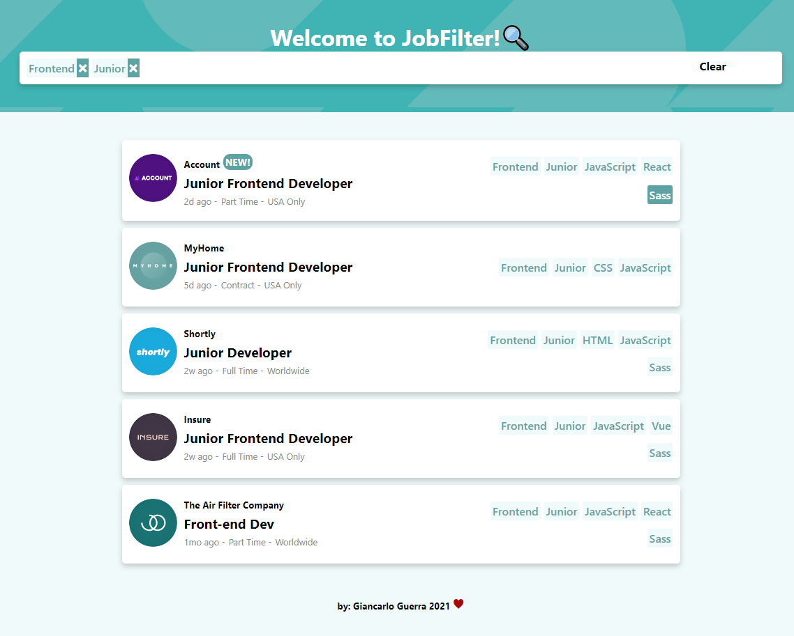
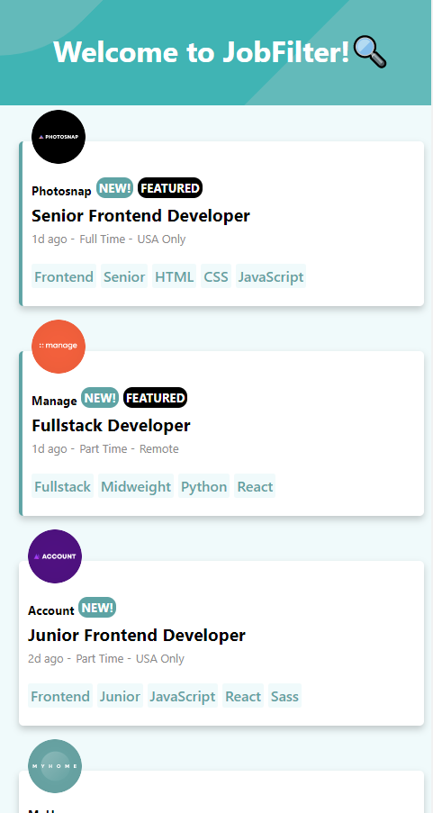
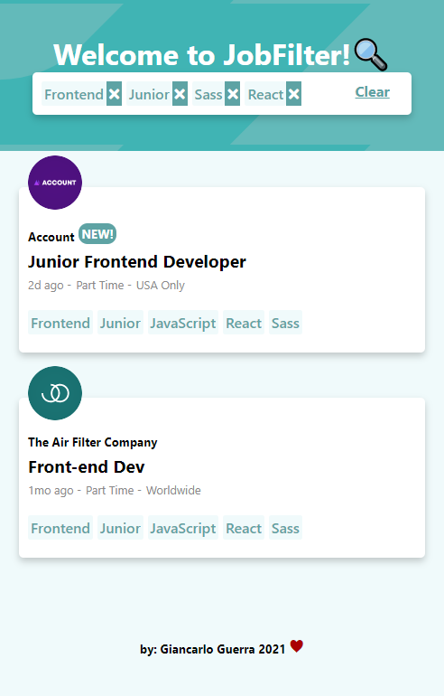

# Giancarlo Guerra - Job listings with filtering solution

This is a solution to the [Job listings with filtering challenge on Frontend Mentor](https://www.frontendmentor.io/challenges/job-listings-with-filtering-ivstIPCt). Frontend Mentor challenges help you improve your coding skills by building realistic projects. 

## Table of contents

- [Overview](#overview)
  - [The challenge](#the-challenge)
  - [Screenshot](#screenshot)
  - [Links](#links)
- [My process](#my-process)
  - [Built with](#built-with)
  - [What I learned](#what-i-learned)
  - [Continued development](#continued-development)
 
- [Author](#author)


## Overview

### The challenge

Users should be able to:

- View the optimal layout for the site depending on their device's screen size
- See hover states for all interactive elements on the page
- Filter job listings based on the categories

### Screenshot






### Links

- Solution URL: [Add solution URL here](https://your-solution-url.com)
- Live Site URL: [Add live site URL here](https://your-live-site-url.com)

## My process

### Built with

- Semantic HTML5 markup
- CSS custom properties
- Flexbox
- CSS Grid
- [React](https://reactjs.org/) - JS library


### What I learned

Making this project helped me to understand better the use of states in React, especially in 3 points:

- How to use it.
- Where to use it.
- When to use it. 

Also, I learned more about rendering when any of the states changes. When so, I must take care to update related states.

e.g:
```js
let clear=()=>{
    setTags([]) //I set a new value to tags state.
    setDisplay(data) //But also I must update display state.
  };
```


### Continued development

Later I want to remake this project, not with fake data, but with data from a jobs API to improve fetching data from other sources and to have a better understanding of HTTP requests.


## Author 

### Giancarlo Guerra F.
- LinkedIn - [@GiancarloGuerraF](https://www.linkedin.com/in/GiancarloGuerraF)
- Github - [@GiancarloGF](https://github.com/GiancarloGF)
- Frontend Mentor - [@GiancarloGF](https://www.frontendmentor.io/profile/GiancarloGF)
